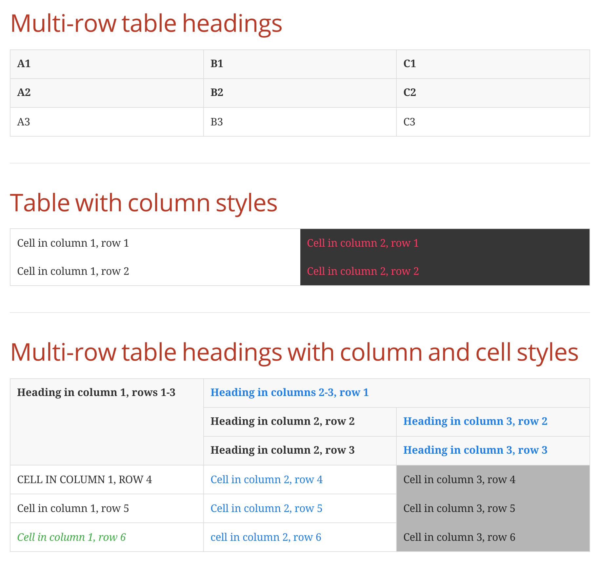

= README

== Build

Using Maven:

 $ mvn clean package

Using `asciidoctor` CLI:

.convert to HTML 5
 $ asciidoctor ./src/docs/asciidoc/introduction.adoc \
  -D ./target/docs/asciidoc \
  -r ./src/docs/extensions/multirow-table-head-tree-processor.rb \
  -r ./src/docs/extensions/feat-1338.rb

.convert to DocBook 5
 $ asciidoctor -b docbook5 ./src/docs/asciidoc/introduction.adoc \
  -D ./target/docs/asciidoc \
  -r ./src/docs/extensions/multirow-table-head-tree-processor.rb \
  -r ./src/docs/extensions/feat-1338.rb

== Usage

.Multi-row table headings
[source,adoc]
----
[cols=3,hrows=2]
|====
| A1
| B1
| C1

| A2
| B2
| C2

| A3
| B3
| C3
|====
----

.Table with column styles
[source,adoc]
----
[cols="1[.is-borderless],1[.has-background-dark.has-text-danger.is-borderless]"]
|===
|Cell in column 1, row 1
|Cell in column 2, row 1

|Cell in column 1, row 2
|Cell in column 2, row 2
|===
----

.Multi-row table headings with column and cell styles
[source,adoc]
----
[cols="1,1[.has-text-info],1[.has-text-white.has-background-grey-light.is-borderless]",hrows="3"]
|====
.3+|Heading in column 1, rows 1-3
2+|Heading in columns 2-3, row 1
|Heading in column 2, row 2

|Heading in column 3, row 2
|Heading in column 2, row 3
|Heading in column 3, row 3

[.is-uppercase]|Cell in column 1, row 4
|Cell in column 2, row 4
|Cell in column 3, row 4

|Cell in column 1, row 5
|Cell in column 2, row 5
|Cell in column 3, row 5

[.is-italic.has-text-success]|Cell in column 1, row 6
[.is-lowercase]|Cell in column 2, row 6
|Cell in column 3, row 6
|====
----

== Result

